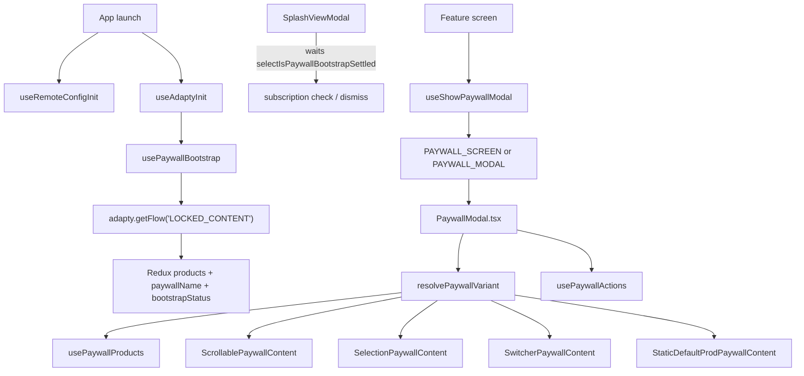

# Moonlit PaywallModal

Custom Adapty paywall UI. Runtime `adapty.*` calls are allowed only in `useAdaptyInit`, `usePaywallBootstrap`, `useHandleCheckSubscription`, and `usePaywallActions`.

For navigation entry and placement routing, use the **`moonlit-paywall-flow`** agent after reading this skill.

## When to use this skill

- Changing layout, hooks, or components under `src/screens/PaywallModal/`
- Adding or refactoring a paywall **content variant**
- Debugging paywall load/purchase/skip behavior
- Deciding where a new file belongs (shell vs variant-level)

## End-to-end flow

## Placement and variant names

Single Adapty placement in `src/constants/common.ts`:

| Constant                      | Value            |
| :---------------------------- | :--------------- |
| `LOCKED_CONTENT_PLACEMENT_ID` | `LOCKED_CONTENT` |

Bootstrap stores the **full** Adapty `AdaptyFlow.name` in Redux (e.g. `SELECTION_TRIAL`). UI variant is resolved at lookup time in `paywallVariantRegistry.ts` via **`resolvePaywallVariantName`** — prefix match against base `PAYWALL_NAMES` after `trim().toUpperCase()` (longest base name first). Postfix A/B names share one content variant:

| Base name (`PAYWALL_NAMES`) | Example Adapty names               | Component                         |
| :-------------------------- | :--------------------------------- | :-------------------------------- |
| `TOGGLE`                    | `TOGGLE`, `TOGGLE_TRIAL`           | `SwitcherPaywallContent`          |
| `SELECTION`                 | `SELECTION`, `SELECTION_WEEK_9_99` | `SelectionPaywallContent`         |
| `SCROLLABLE`                | `SCROLLABLE`, `SCROLLABLE_EXTRA`   | `ScrollablePaywallContent`        |
| `STATIC_DEFAULT_PROD`       | `STATIC_DEFAULT_PROD`              | `StaticDefaultProdPaywallContent` |

| Export                        | Use                                                                                   |
| :---------------------------- | :------------------------------------------------------------------------------------ |
| `resolvePaywallVariantName`   | Base variant for scrollable layout, toggle default-trial, `isKnownPaywallVariantName` |
| `resolvePaywallVariant`       | Shell content component                                                               |
| `resolvePaywallAnalyticsType` | `PAYWALL_TYPE` for analytics                                                          |

Unknown names fall back to `SwitcherPaywallContent` / `WITH_SWITCHER`. Do not compare raw `paywallName` to `PAYWALL_NAMES.*` — use `resolvePaywallVariantName`. Configure A/B postfix names in the Adapty dashboard — not via remote config placement.

`remoteConfigService.fetchAndActivate()` runs once at launch via `useRemoteConfigInit` in `AppLogicProvider`. Paywall copy (`toggle_state`, buy button texts) and analytics `segment` read from the activated **Firebase** config in `usePaywallProducts` and `analytics.ts`.

**Adapty paywall remote config** (`AdaptyFlow.remoteConfigs`, one entry per locale) is separate from Firebase. `usePaywallBootstrap` picks English (or the first locale) via `pickFlowRemoteConfigData` and stores `data` in Redux as `paywallRemoteConfig`; `useShowPaywallModal` passes it as nav param `remoteConfig`; `PaywallModal` parses it via `parsePaywallRemoteConfig` in `utils/paywallRemoteConfig.utils.ts` and forwards typed `remoteConfig` to variants.

| Adapty key (`remoteConfigs[].data`) | Parsed field           | Consumer                                                                                                                  |
| :---------------------------------- | :--------------------- | :------------------------------------------------------------------------------------------------------------------------ |
| `show_bottom_skip_button`           | `showBottomSkipButton` | `PaywallModal` hides top-left skip when `true`; all variants show footer skip via `FooterActions`                         |
| `buy_button_text`                   | `buyButtonText?`       | `StaticDefaultProdPaywallContent` CTA — overrides trial-aware `ctaLabel` when set (fallback: `staticDefaultProdCtaLabel`) |
| `subtitle_text`                     | `subtitleText?`        | `StaticDefaultProdPaywallContent` subtitle                                                                                |
| `title_text`                        | `titleText?`           | `StaticDefaultProdPaywallContent` title                                                                                   |

Empty / whitespace / non-string values fall back to localized defaults. `show_bottom_skip_button` must be JSON boolean `true` (string `"true"` is treated as false).

## File placement

Everything lives under `src/screens/PaywallModal/`.

| Location                                                         | Belongs here                                                           |
| :--------------------------------------------------------------- | :--------------------------------------------------------------------- |
| `PaywallModal.tsx`, `PaywallModal.styles.ts`                     | Shell: variant registry, shared hooks, loading state                   |
| `paywallVariantRegistry.ts`                                      | Prefix-resolves `AdaptyFlow.name` → variant component + analytics type |
| `hooks/usePaywallProducts.ts`, `hooks/usePaywallActions.ts`      | Shared product selection and purchase/restore/skip actions             |
| `utils/paywallProduct.utils.ts`                                  | Product resolution + StoreKit-safe price/period formatting             |
| `utils/paywallRemoteConfig.utils.ts`                             | Parses Adapty `remoteConfig.data` → typed `PaywallRemoteConfig`        |
| `components/PaywallBackground/`                                  | Shared background asset                                                |
| `contentVariants/{Scrollable,Selection,Switcher}PaywallContent/` | Variant-specific UI, styles, product hooks                             |
| `contentVariants/StaticDefaultProdPaywallContent/`               | Static prod variant — see § STATIC_DEFAULT_PROD below                  |
| `contentVariants/components/TrialSwitch/`                        | Shared trial toggle across variants                                    |

Bootstrap hooks live outside the screen folder:

| Hook                  | Location                           | Role                                              |
| :-------------------- | :--------------------------------- | :------------------------------------------------ |
| `useRemoteConfigInit` | `src/hooks/useRemoteConfigInit.ts` | Fetches and activates Firebase Remote Config once |
| `useAdaptyInit`       | `src/hooks/useAdaptyInit.ts`       | Activates Adapty SDK once at app launch           |
| `usePaywallBootstrap` | `src/hooks/usePaywallBootstrap.ts` | Fetches paywall + products into Redux             |

All three run in `AppLogicProvider`. `SplashViewModal` gates on `selectIsPaywallBootstrapSettled` (`ready` or `failed`) before subscription check. Cold start skips paywall when bootstrap failed.

## Product resolution and pricing

Adapty products from App Store / TestFlight must not be classified by raw `price.amount` comparisons — that leaves `yearlyProduct` undefined and UI shows literal `"undefined"`.

**Single source:** `src/screens/PaywallModal/utils/paywallProduct.utils.ts`

| Export                                                   | Use                                                                                                                         |
| :------------------------------------------------------- | :-------------------------------------------------------------------------------------------------------------------------- |
| `resolvePaywallProducts(products)`                       | Maps catalog → `{ trialProduct, weeklyProduct, yearlyProduct }` by subscription period (`week` / `year`) and offer presence |
| `formatProductLocalizedPrice(product)`                   | Display price — prefers Adapty `price.localizedString`, then currency fallbacks                                             |
| `formatPriceValue(amount, product)`                      | Derived amounts (e.g. yearly ÷ 52 weeks) — never template-literal `currencySymbol` alone                                    |
| `getFreeTrialOfferDays(product)`                         | Trial length from `subscription.offer.phases` (not main `subscriptionPeriod`)                                               |
| `getLocalizedSubscriptionPeriodLabel(product, localize)` | Period label for copy (`week` / `year` keys or Adapty localized period)                                                     |

**Contracts:**

- `usePaywallProducts` calls `resolvePaywallProducts` — variant hooks receive resolved products; do not re-implement matching logic.
- Variant hooks (`useSwitcherPaywallProducts`, `useScrollablePaywallProducts`, `useSelectionPaywallProducts`) import formatters from utils — do not build prices from optional `currencySymbol` / `currencyCode` fields directly.
- Trial product = first subscription with `subscription.offer`. Yearly = `unit === 'year'` (may equal trial SKU when offer is on annual).

## Navigation & dismiss contract

- **Opener**: `useShowPaywallModal` (`src/hooks/navigation/useShowPaywallModal.ts`) — passes `products`, `paywallName`, `remoteConfig`, `source`, `onClose`, `contentName`, `tab`. Queues requests while bootstrap is pending; calls `onClose` when bootstrap failed.
- **Routes**: `RootRoutes.PAYWALL_SCREEN` (push) or `RootRoutes.PAYWALL_MODAL` (modal group).
- **Dismiss**: `onClose` callback from opener; `handleSkipPress` in `usePaywallActions` calls `onClose` after skip analytics.
- **Subscription gate**: `useHandleCheckSubscription` checks Adapty profile and updates Redux `user` slice.

## Localization

Paywall strings in `src/localization/locals/paywall.ts`.

## STATIC_DEFAULT_PROD variant

Root: `contentVariants/StaticDefaultProdPaywallContent/`

| File / folder                                  | Role                                                                                                                                                      |
| :--------------------------------------------- | :-------------------------------------------------------------------------------------------------------------------------------------------------------- |
| `StaticDefaultProdPaywallContent.tsx`          | Root component — hero, `ProdTrialCard`, plan rows, `ProdCtaButton`, `FooterActions`; consumes Adapty `remoteConfig` for title/subtitle/CTA/skip placement |
| `hooks/useStaticDefaultProdPaywallProducts.ts` | Derives `weeklyIsSelected`, `yearlyIsSelected`, per-week price (`yearlyPrice / 52`), `ctaLabel`, `dueTodayText` from resolved products                    |
| `components/ProdTrialCard/`                    | Collapsible trial toggle card; expand/collapse driven by `useProdTrialCardAnimation`                                                                      |
| `components/ProdPlanRow/`                      | Selectable plan row with `LinearGradient` border and optional badge label                                                                                 |
| `components/ProdCtaButton/`                    | Primary CTA with sun-bleed sweep + chevron shake; driven by `useProdCtaAnimation`                                                                         |

**Selection logic** — `weeklyIsSelected` is true when `selectedProduct === trialProduct` (if `isFreeTrialEnabled`) or `=== weeklyProduct`; `yearlyIsSelected` when `=== yearlyProduct`. Tapping "weekly" row selects `trialProduct` when trial is enabled, else `weeklyProduct`.

**Animation constants:**

| Hook                        | Effect                                                                          | Duration / timing                                                                                                                 |
| :-------------------------- | :------------------------------------------------------------------------------ | :-------------------------------------------------------------------------------------------------------------------------------- |
| `useProdTrialCardAnimation` | Expand/collapse + `interpolateColor` (surface, border, indicator)               | 240 ms, cubic-bezier(0.65, 0, 0.35, 1); respects `ReduceMotion.System`                                                            |
| `useProdCtaAnimation`       | Sun-bleed sweep across button width (`BLEED_WIDTH_RATIO = 0.19`, `-30deg` tilt) | 2 000 ms sweep, 3 000 ms pause, eased bezier(0.22, 1, 0.36, 1)                                                                    |
| `useProdCtaAnimation`       | Chevron horizontal shake (±2 px, 6-keyframe interpolation)                      | 2 000 ms, 200 ms post-pause; `AccessibilityInfo.isReduceMotionEnabled()` + `reduceMotionChanged` listener cancels both animations |

**Analytics**: registered as `PAYWALL_TYPE.WITH_STATIC_DEFAULT_PROD` in `analytics.constants.ts`.

**Localization keys** (all in `paywall.ts` `staticDefaultProd*` namespace): `staticDefaultProdCtaLabel`, `staticDefaultProdDueTodayTemplate`, `staticDefaultProdPlanYearlyDetail`, `staticDefaultProdPlanWeeklyDetail`, `staticDefaultProdPerWeek`, `staticDefaultProdMostPopular`, `staticDefaultProdBestValue`, plus shared `YEARLY` / `WEEKLY` keys.

## Tests

- `src/hooks/__tests__/navigation/useShowPaywallModal.test.ts`
- `src/hooks/__tests__/useRemoteConfigInit.test.ts`
- `src/hooks/__tests__/useAdaptyInit.test.ts`
- `src/hooks/__tests__/usePaywallBootstrap.test.ts`
- `src/screens/PaywallModal/utils/__tests__/paywallRemoteConfig.utils.test.ts`
- `src/screens/PaywallModal/contentVariants/StaticDefaultProdPaywallContent/__tests__/StaticDefaultProdPaywallContent.test.tsx`
- `src/hooks/__tests__/useHandleCheckSubscription.test.ts`
- `src/screens/PaywallModal/__tests__/paywallVariantRegistry.test.ts`
- `src/screens/PaywallModal/utils/__tests__/paywallProduct.utils.test.ts`
- `src/screens/__tests__/SplashViewModal.test.tsx`
- Mock `adapty` in tests — not live SDK calls.
