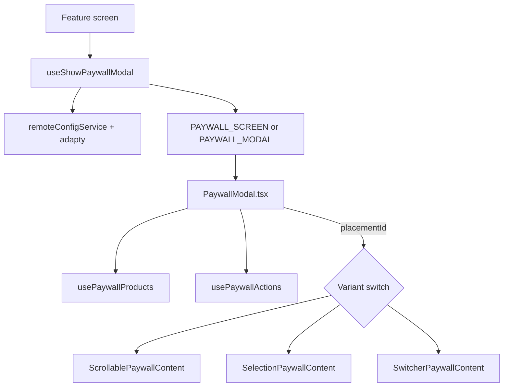

# Moonlit PaywallModal

Custom Adapty paywall UI. Runtime `adapty.*` calls are allowed only in `useShowPaywallModal`, `useHandleCheckSubscription`, and `usePaywallActions`.

For navigation entry and placement routing, use the **`moonlit-paywall-flow`** agent after reading this skill.

## When to use this skill

- Changing layout, hooks, or components under `src/screens/PaywallModal/`
- Adding or refactoring a paywall **content variant**
- Debugging paywall load/purchase/skip behavior
- Deciding where a new file belongs (shell vs variant-level)

## End-to-end flow

## Placement IDs

Defined in `src/constants/common.ts`:

| Constant                  | Placement ID             | Variant                    |
| :------------------------ | :----------------------- | :------------------------- |
| `SWITCH_PLACEMENT_ID`     | `FULL_ACCESS`            | `SwitcherPaywallContent`   |
| `SELECTION_PLACEMENT_ID`  | `FULL_ACCESS_SELECTION`  | `SelectionPaywallContent`  |
| `SCROLLABLE_PLACEMENT_ID` | `FULL_ACCESS_SCROLLABLE` | `ScrollablePaywallContent` |

`remoteConfigService` selects the active placement; products loaded via `adapty` in `useShowPaywallModal`.

## File placement

Everything lives under `src/screens/PaywallModal/`.

| Location                                                         | Belongs here                                               |
| :--------------------------------------------------------------- | :--------------------------------------------------------- |
| `PaywallModal.tsx`, `PaywallModal.styles.ts`                     | Shell: variant switch, shared hooks, loading state         |
| `hooks/usePaywallProducts.ts`, `hooks/usePaywallActions.ts`      | Shared product selection and purchase/restore/skip actions |
| `components/PaywallBackground/`                                  | Shared background asset                                    |
| `contentVariants/{Scrollable,Selection,Switcher}PaywallContent/` | Variant-specific UI, styles, product hooks                 |
| `contentVariants/components/TrialSwitch/`                        | Shared trial toggle across variants                        |

## Navigation & dismiss contract

- **Opener**: `useShowPaywallModal` (`src/hooks/navigation/useShowPaywallModal.ts`) — passes `products`, `placementId`, `source`, `onClose`, `contentName`, `tab`.
- **Routes**: `RootRoutes.PAYWALL_SCREEN` (push) or `RootRoutes.PAYWALL_MODAL` (modal group).
- **Dismiss**: `onClose` callback from opener; `handleSkipPress` in `usePaywallActions` calls `onClose` after skip analytics.
- **Subscription gate**: `useHandleCheckSubscription` checks Adapty profile and updates Redux `user` slice.

## Localization

Paywall strings in `src/localization/locals/paywall.ts`.

## Tests

- `src/hooks/__tests__/navigation/useShowPaywallModal.test.ts`
- `src/hooks/__tests__/useHandleCheckSubscription.test.ts`
- Mock `adapty` in tests — not live SDK calls.
