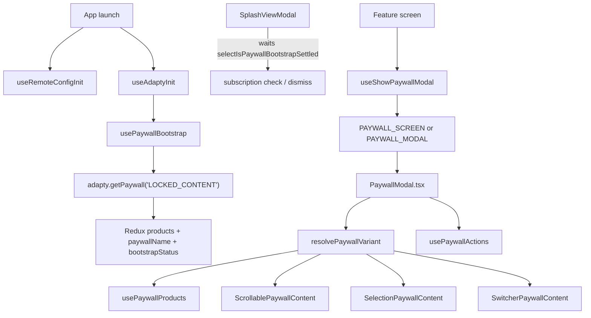

# Moonlit PaywallModal

Custom Adapty paywall UI. Runtime `adapty.*` calls are allowed only in `useAdaptyInit`, `usePaywallBootstrap`, `useHandleCheckSubscription`, and `usePaywallActions`.

For navigation entry and placement routing, use the **`moonlit-paywall-flow`** agent after reading this skill.

## When to use this skill

- Changing layout, hooks, or components under `src/screens/PaywallModal/`
- Adding or refactoring a paywall **content variant**
- Debugging paywall load/purchase/skip behavior
- Deciding where a new file belongs (shell vs variant-level)

## End-to-end flow

## Placement and variant names

Single Adapty placement in `src/constants/common.ts`:

| Constant                      | Value            |
| :---------------------------- | :--------------- |
| `LOCKED_CONTENT_PLACEMENT_ID` | `LOCKED_CONTENT` |

UI variant is resolved from Adapty `paywall.name` via `paywallVariantRegistry.ts`:

| Adapty paywall name | Component                  |
| :------------------ | :------------------------- |
| `TOGGLE`            | `SwitcherPaywallContent`   |
| `SELECTION`         | `SelectionPaywallContent`  |
| `SCROLLABLE`        | `ScrollablePaywallContent` |

Unknown names fall back to `SwitcherPaywallContent`. Configure A/B variants in the Adapty dashboard by paywall name — not via remote config placement.

`remoteConfigService.fetchAndActivate()` runs once at launch via `useRemoteConfigInit` in `AppLogicProvider`. Paywall copy (`toggle_state`, buy button texts) and analytics `segment` read from the activated config in `usePaywallProducts` and `analytics.ts`.

## File placement

Everything lives under `src/screens/PaywallModal/`.

| Location                                                         | Belongs here                                               |
| :--------------------------------------------------------------- | :--------------------------------------------------------- |
| `PaywallModal.tsx`, `PaywallModal.styles.ts`                     | Shell: variant registry, shared hooks, loading state       |
| `paywallVariantRegistry.ts`                                      | Maps `paywall.name` → variant component + analytics type   |
| `hooks/usePaywallProducts.ts`, `hooks/usePaywallActions.ts`      | Shared product selection and purchase/restore/skip actions |
| `components/PaywallBackground/`                                  | Shared background asset                                    |
| `contentVariants/{Scrollable,Selection,Switcher}PaywallContent/` | Variant-specific UI, styles, product hooks                 |
| `contentVariants/components/TrialSwitch/`                        | Shared trial toggle across variants                        |

Bootstrap hooks live outside the screen folder:

| Hook                  | Location                           | Role                                              |
| :-------------------- | :--------------------------------- | :------------------------------------------------ |
| `useRemoteConfigInit` | `src/hooks/useRemoteConfigInit.ts` | Fetches and activates Firebase Remote Config once |
| `useAdaptyInit`       | `src/hooks/useAdaptyInit.ts`       | Activates Adapty SDK once at app launch           |
| `usePaywallBootstrap` | `src/hooks/usePaywallBootstrap.ts` | Fetches paywall + products into Redux             |

All three run in `AppLogicProvider`. `SplashViewModal` gates on `selectIsPaywallBootstrapSettled` (`ready` or `failed`) before subscription check. Cold start skips paywall when bootstrap failed.

## Navigation & dismiss contract

- **Opener**: `useShowPaywallModal` (`src/hooks/navigation/useShowPaywallModal.ts`) — passes `products`, `paywallName`, `source`, `onClose`, `contentName`, `tab`. Queues requests while bootstrap is pending; calls `onClose` when bootstrap failed.
- **Routes**: `RootRoutes.PAYWALL_SCREEN` (push) or `RootRoutes.PAYWALL_MODAL` (modal group).
- **Dismiss**: `onClose` callback from opener; `handleSkipPress` in `usePaywallActions` calls `onClose` after skip analytics.
- **Subscription gate**: `useHandleCheckSubscription` checks Adapty profile and updates Redux `user` slice.

## Localization

Paywall strings in `src/localization/locals/paywall.ts`.

## Tests

- `src/hooks/__tests__/navigation/useShowPaywallModal.test.ts`
- `src/hooks/__tests__/useRemoteConfigInit.test.ts`
- `src/hooks/__tests__/useAdaptyInit.test.ts`
- `src/hooks/__tests__/usePaywallBootstrap.test.ts`
- `src/hooks/__tests__/useHandleCheckSubscription.test.ts`
- `src/screens/PaywallModal/__tests__/paywallVariantRegistry.test.ts`
- `src/screens/__tests__/SplashViewModal.test.tsx`
- Mock `adapty` in tests — not live SDK calls.
