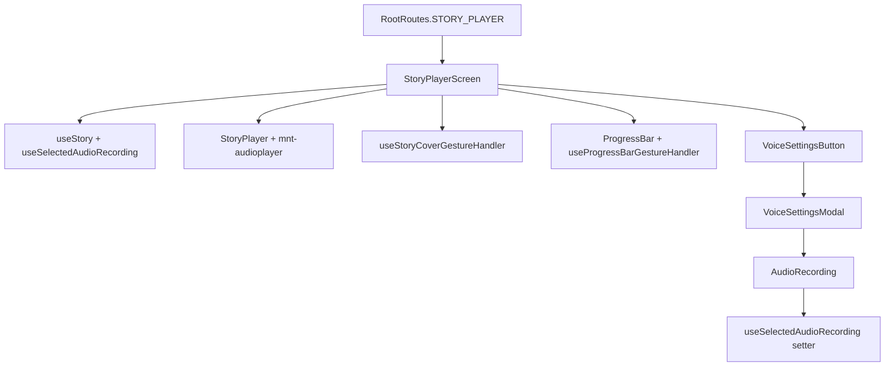

# Moonlit Story Player

The story player is the core playback experience: tale audio via native player, cover collapse gestures, progress scrubbing, and voice customization.

## When to use this skill

- Changing `StoryPlayerScreen` layout, player controls, or cover animation
- Editing `VoiceSettingsModal` or `AudioRecording` recording flow
- Integrating `mnt-audioplayer` native module
- Debugging gesture/worklet issues on cover or progress bar

## End-to-end flow

## File placement

Under `src/screens/StoryPlayerScreens/`:

| Location                                            | Belongs here                                                                          |
| :-------------------------------------------------- | :------------------------------------------------------------------------------------ |
| `StoryPlayerScreen/StoryPlayerScreen.tsx`           | Main screen shell, layout, pause on collapse                                          |
| `StoryPlayerScreen/hooks/`                          | `useStoryPlayerScreenLayout`, `useStoryCoverGestureHandler`, `useStoryCoverAnimation` |
| `StoryPlayerScreen/components/StoryPlayer/`         | Player UI, loader, progress bar                                                       |
| `StoryPlayerScreen/components/StoryMeta/`           | Tale metadata display                                                                 |
| `StoryPlayerScreen/components/VoiceSettingsButton/` | Opens voice settings modal                                                            |
| `VoiceSettingsModal/`                               | Voice selection and recording modal                                                   |
| `VoiceSettingsModal/components/AudioRecording/`     | User voice recording UI                                                               |

## Native audio player

- Package: `mnt-audioplayer` (`src/native_modules/MNTAudioPlayer`)
- Consumed via native module bridge — do not duplicate playback logic in JS.
- New native APIs: use `moonlit-native-turbomodule-scaffolder` agent.

## Realm integration

- **Story data**: `useStory(storyId)` for tale metadata.
- **Voice selection**: `useSelectedAudioRecording(storyId)` — `{ selectedAudioRecording, setSelectedAudioRecording }`.
- **Recordings list**: `useAudioRecordings` in voice settings.
- Never query Realm directly in screen components.

## Reanimated gestures

All worklet → JS callbacks use `scheduleOnRN` from `react-native-worklets`:

- `useStoryCoverGestureHandler` — cover collapse on swipe
- `useProgressBarGestureHandler` — tap/pan scrubbing
- `StoryPlayerScreen` — `scheduleOnRN(handlePauseStory)` on collapse

See `moonlit-reanimated.mdc` / `.agents/rules/reanimated.md`.

## Localization

Story player strings in `src/localization/locals/stories.ts`.

## Headers

Story player may use `ScreenHeader` with `scrollPositionSharedValue` for large-title collapse — see `moonlit-headers.mdc`.
