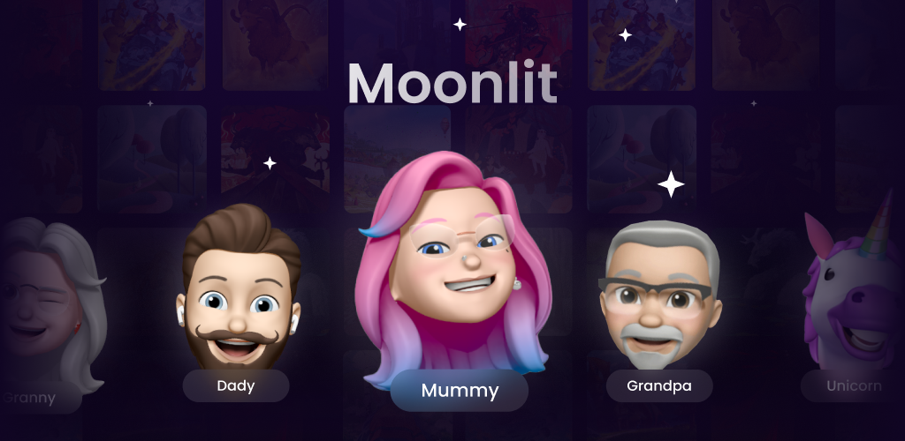
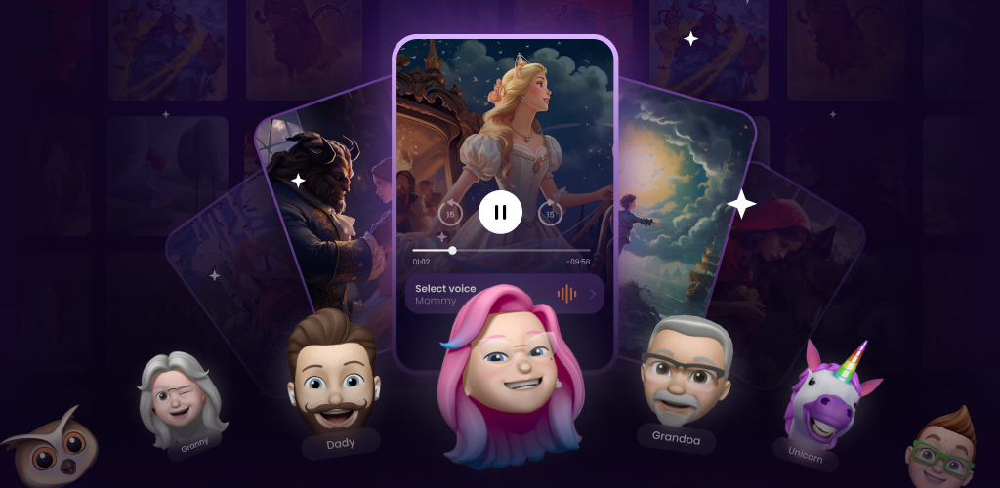

# [Moonlit: Soothing Bedtime Stories for Kids](moonlit.ltd)

Introducing [Moonlit](moonlit.ltd), the ultimate bedtime companion designed to enchant, soothe, and whisk your little ones away to a land of dreams through the timeless magic of fairy tales. With Moonlit, bedtime becomes an eagerly awaited moment, filled with adventure, wonder, and tranquility.

*A Treasury of Tales: Explore a carefully curated selection of fairy tales including "Cinderella," "Little Red Riding Hood," "The Three Little Pigs," "Jack and the Beanstalk," "The Snow Queen," "Hansel and Gretel," "The Golden Fish", "Aladdin and the Magic Lamp," "Puss in Boots," "Sleeping Beauty," "Snow White and the Seven Dwarfs", "Rapunzel" and "Beauty and the Beast." Each story is chosen for its ability to spark the imagination and nurture the soul.
Diverse Narration Voices: Choose from five unique and soothing voices to narrate the stories. Each voice is selected for its warm, calming quality, ensuring a gentle transition to sleep.
Simple and User-Friendly: Moonlit is designed with both parents and children in mind, offering a straightforward, hassle-free experience. Navigate through our collection with ease and select the perfect story night after night.
Benefits:
Enhances Bedtime Routine: Moonlit transforms bedtime from a struggle to a treasured ritual, making it easier for children to settle down and for parents to enjoy peaceful evenings.
Fosters Imagination and Creativity: The classic tales not only entertain but also stimulate the imagination, encouraging creativity and a love for storytelling.
Promotes Relaxation and Sleep: The soothing voices and narrative pace are specifically chosen to calm young listeners, helping them unwind and fall asleep more easily.
Builds Fond Memories: Sharing these timeless stories creates lasting memories and strengthens the bond between parents and children, establishing a tradition of nightly storytelling.
Moonlit is more than just an app; it's a gateway to a world of dreams and gentle rest. Perfect for children of all ages and their families, Moonlit ensures that every bedtime is a magical, restful journey.*

[Download Moonlit](https://apps.apple.com/app/moonlit-tales/id6471524142) now and turn bedtime into the most enchanting part of your child's day. Let the stories begin!

### [Get on the App Store](https://apps.apple.com/app/moonlit-tales/id6471524142)